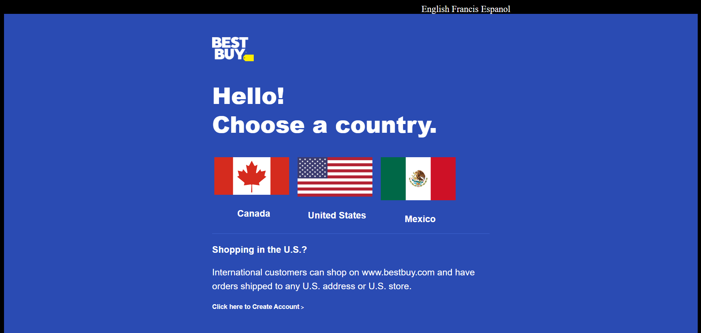
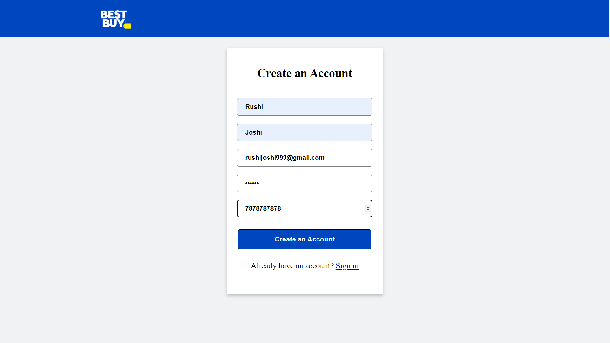
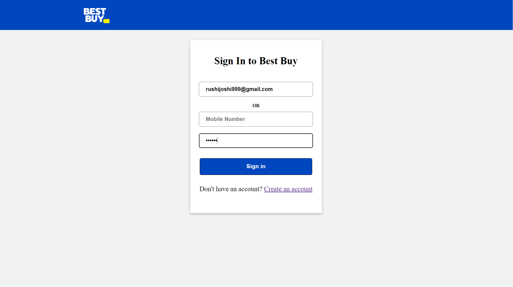

# Welcome to ebuzz

<h3>Best Buy is a consumer electronics retailer with operations in the U.S., Mexico, and Canada. The company sells a wide variety of items, including mobile phones, digital cameras, video games, and other Electronic Items. An Individual project built in only 5 Days.
</h3>

# Deployed URL 👉 [Click here](https://cheerful-biscuit-e9e33e.netlify.app/)

- Rushi Joshi (My Linkedin profile :- https://www.linkedin.com/in/rushijoshi3798/)

   

 
<h4 align="center">💻 Tech Stack</h4>
 

 
 
 

 

<h3 align="center">Tools</h3> 
  
  
   

 

## Let's Dive into What we have made

## Landing Page :

## Signup Page :

## Login Page :

## Home Page :

## Cart Page :

## Checkout Page :

Source Code(GitHub link):- https://github.com/Rushijoshi3798/Best-Buy

## Show your support

Give a ⭐️ if you like this project!

### Thank you
